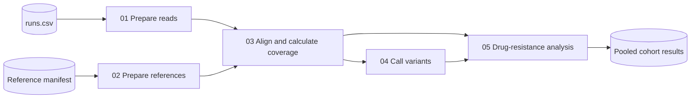

# ampliresist

ONT amplicon variant calling and *Plasmodium falciparum* drug-resistance
genotyping — **one pipeline, one command**.

Adapted from [sanger-pathogens/nano-rave](https://github.com/sanger-pathogens/nano-rave)
(© 2022, 2023 Genome Research Ltd.).

## Overview

Five subworkflows compose the pipeline:



The drug-resistance subworkflow produces amplicon coverage (stage 12), genotype
calls (13), resistance frequencies (14), summary tables (15), and conservative
complexity-of-infection classifications (17).

Alignment is the fan-out point: every retained barcode is aligned independently
to each of the seven reference amplicons.

The drug-resistance analysis runs over the pooled cohort, not per flowcell.
Allele frequencies are properties of the *sample set*, so splitting them per
flowcell would compute the wrong denominators. Per-flowcell QC (`01_qc/`,
`02_coverage/`, `03_variants/`) is still emitted per run.

## What you need to supply

Production runs require cohort-specific sequencing data and metadata:

| Input | Requirement | How to supply |
|---|---|---|
| Sequencing runs | canonical layout `<data>/<run>/<flowcell>/{fastq_pass/, sequencing_summary_*.txt}` | generate `assets/runs.csv` with `bin/make_run_samplesheet.sh` (validates the layout) |
| `--samplesheet` | one metadata row per `(ont_multiplex_group, ont_barcode)`; **`.xlsx`**, sheet `samplesheet` | **required** for the resistance analysis; build from `assets/samplesheet.template.csv` |
| Clair3 model | must match the basecaller chemistry | bundled/downloaded R10.4.1 model (`assets/references/clair3_models/PROVENANCE.md`) or `--clair3_model <dir>` |

The cleaned ecological metadata for the figures is **derived from `--samplesheet`
inside the workflow** (module `18a` `CLEAN_METADATA`) and passed to plotting by
channel — it is no longer a separately maintained file. `--plot_metadata` remains
only as an optional override for standalone plotting.

The reference amplicon FASTAs (`assets/references/`, 5 drug-resistance loci —
`crt dhfr dhps mdr1 k13` — plus 2 antigen/diversity loci, `csp` and `msp1`; see
`assets/references/PROVENANCE.md`), the marker resources (`assets/resources/`) and
the Ghana boundary assets (`assets/geo/`, geoBoundaries, CC BY 4.0) **are** included.
The Clair3 R10.4.1 model is obtained per `assets/references/clair3_models/PROVENANCE.md`.
`csp` and `msp1` are **not** drug-resistance genes.

`run_name` in `--input` must match `ont_multiplex_group` in the sample sheet.

## Quick start

```bash
cd 04_workflow

# 0. one-off: build the two ampliresist-owned images (see docs/containers.md;
#    replace 'owner' with your registry namespace)
docker build -t ghcr.io/owner/ampliresist-r:1.0.0       -f containers/r.Dockerfile       containers/
docker build -t ghcr.io/owner/ampliresist-figures:1.0.0 -f containers/figures.Dockerfile containers/

# 1. smoke test — self-contained (bundled test data + workbook)
nextflow run . -profile test,docker

# 2. build the run manifest by scanning the (canonical-layout) data directory
bin/make_run_samplesheet.sh ../02_data > assets/runs.csv

# 3. full run — all flowcells, one command
nextflow run . -profile docker \
    --input assets/runs.csv \
    --samplesheet /path/to/samplesheet.xlsx \
    --outdir ../05_results -resume
```

`--input` and `--samplesheet` are required; references, Clair3 model, geo and
resources default under `assets/`. Public tool images are pinned by digest; the
two owned images resolve through `--container_registry` (default `ghcr.io/owner`).
See **[docs/containers.md](docs/containers.md)** for build/pull/publish.

## Inputs

**`--input`** — one row per flowcell. Any number of runs; they are pooled into one
cohort for the analyses.

```csv
run_name,sequencing_dir,sequencing_summary
LUC_DRAG1_IMPAVESRUN23_20250920,/…/20250920_1723_X1_FAZ03468_…,/…/sequencing_summary_….txt
```

> `run_name` **must** match `ont_multiplex_group` in `assets/samplesheet.xlsx`.
> Any run missing from the workbook aborts the analysis rather than being silently
> dropped.
>
> Samples are keyed on **(run, barcode)**, not barcode alone — `barcode01` exists
> on every flowcell, so a barcode-only join would mis-assign samples once the runs
> are pooled.

The resistance analysis needs the **full amplicon panel** (crt, dhfr, dhps, mdr1,
k13, csp, msp1). A cut-down `--reference_manifest` is fine for variant calling
only (`--drug_resistance false`).

## Key parameters

| Parameter | Default | Notes |
|---|---|---|
| `--input` | *(required)* | Run manifest (`run_name,sequencing_dir,sequencing_summary`) |
| `--samplesheet` | *(required for `--drug_resistance`)* | Metadata workbook (`.xlsx`, sheet `samplesheet`); cleaned figure metadata is derived from it |
| `--container_registry` | `ghcr.io/owner` | Namespace for the ampliresist-owned images; replace `owner`. Public images are digest-pinned in-module |
| `--cohort_name` | `DRAG1_cohort` | Names the pooled sample set in the analysis outputs |
| `--variant_caller` | `clair3` | The validated path. `medaka`, `medaka_haploid`, `freebayes` are inherited from upstream and **not validated for this assay**. |
| `--clair3_model` | bundled R10.4.1 model | Must match the basecaller chemistry — the Clair3 image ships only R9.4.1 models. |
| `--clair3_args` | `--no_phasing_for_fa --include_all_ctgs --haploid_precise` | The first two are **required**: Clair3's phasing/contig filters assume human chromosomes and emit no genotypes on small Pf amplicons. `--haploid_precise` because *P. falciparum* is haploid. |
| `--min_cov` | `50` | Amplicon median coverage **and** per-SNP depth threshold. |
| `--min_barcode_dir_size` | `10` | MB. If *every* barcode is filtered out the run fails rather than producing nothing. |
| `--drug_resistance` | `true` | Stages 12–15, 17, and the consolidated publication-plot stage 18. |

Parameters are validated against `nextflow_schema.json` before any work starts.

## Results

```
<outdir>/
  01_qc/nanoplot/<run>/ , pycoqc/    per-flowcell QC
  02_coverage/<run>/                 *.bedGraph
  03_variants/<run>/vcf/ , vcf_unzipped/
  04_resistance/                     pooled cohort
    01_coverage_qc/  02_genotype_calls/  03_frequencies/  04_summary/
    05_complexity/
  05_plots/                          publication SVG/PNG figures and source CSVs
  pipeline_info/                     timeline, report, trace, DAG, software_versions.yml
```

`05_plots` includes assay-performance, marker-frequency, UpSet/alluvial
haplotype, artefact-QC, geographic, mutation-landscape, PCoA, co-occurrence
network/matrix, average-linkage clustered heatmap, correspondence-analysis,
mosaic, vector–parasite bipartite, haplotype-network, and forest-interval panels.
Analyses that the available data cannot
support (for example volcano plots or host-vector bipartite networks) are not
fabricated.

## Safeguards

A green Nextflow run only means every process exited 0 — it says nothing about
whether the science is right. This pipeline has already shipped, with exit code 0,
a coverage table whose `sample_id` column contained gene names. These guards exist
because each one corresponds to a failure that actually happened:

| Guard | Catches |
|---|---|
| `_setup.R` sample-id uniqueness | controls (KH2, NC) are re-sequenced on **every** flowcell, so `sample_id` is not unique once runs are pooled. Each sequencing instance is disambiguated (`KH2__<run>`); a residual duplicate aborts. |
| stage 12 fan-out check | the coverage table having more rows than the cohort has samples — the signature of a merge fanning out on a non-unique `sample_id` (one control on 5 runs produced **5⁶ = 15,625** rows). |
| stage 12 join check | no coverage row matching any `sample_id` — a broken join, not a result. |
| stage 14 callability check | *every* marker reporting `n_callable = 0`. |

None of these hardcodes a cohort size: they all derive from the sample sheet
filtered to the runs in `--input`, so they scale from 96 samples to 6,000.

Post-run, `tests/validate_cohort.py` re-checks the published results
independently:

```bash
tests/validate_cohort.py --outdir ../05_results/v2 \
    --input assets/runs.csv --samplesheet assets/samplesheet.xlsx
```

> A clean integer scaling factor between a single run and a pooled cohort is **not**
> evidence of correctness — it is exactly what duplicated input data looks like.

## Testing

| | |
|---|---|
| `nextflow run . -profile test,docker -stub-run` | validates the whole channel topology in seconds |
| `nextflow run . -profile test,docker` | **self-contained** end-to-end run on `assets/test_data/` (2 flowcells × 3 **disjoint** barcodes) with the bundled workbook `tests/fixtures/test_samplesheet.xlsx`. Spans two runs, so it exercises the pooled-cohort path and the (run, barcode) join. |
| `tests/test_run_discovery.sh` | canonical discovery + malformed-layout / ambiguity / duplicate / deprecation checks (synthetic fixtures) |
| `tests/test_containers.sh` | every active image is digest-pinned or owned; no stale cross-pipeline references |
| `bin/download_upstream_test_data.py` | fetches the upstream Sanger nano-rave dataset. Checks the alignment/calling core against upstream, but **cannot** exercise the resistance stages (R9.4.1 chemistry, no Pf panel, no sample sheet). |

## Layout

```
main.nf                  entry workflow — thin; composes five subworkflows
nextflow.config          params, profiles, reporting
nextflow_schema.json     parameter validation (nf-schema)
conf/                    base (resources) · modules (publishDir, ext.args) · test
modules/local/           one process per file, numbered by execution order
  01_sort_fastqs … 08_bedtools_genomecov
  09a_clair3 / 09b_medaka / 09c_medaka_haploid / 09d_freebayes   (alternatives)
  10_bgzip_tabix · 11_gunzip_vcf · 11b_per_call_table
  12_amplicon_coverage … 15_summary_tables      (drug resistance)
  16_dump_versions · 17_complexity_of_infection
  18_publication_plots · 18a_clean_metadata      (figures + derived metadata)
subworkflows/local/
  01_prepare_reads  02_prepare_references  03_align_and_coverage
  04_call_variants  05_drug_resistance
bin/                     executables, staged onto PATH inside each task
  make_run_samplesheet.sh  download_upstream_test_data.py
  01_amplicon_coverage.R … 04_summary_tables.R · 06_complexity_of_infection.R
  08_clean_metadata.R    (derives cleaned figure metadata from the workbook)
  (+ _setup.R, _pipeline_paths.R)
assets/
  resources/  references/ (+ PROVENANCE.md, clair3_models/PROVENANCE.md)
  geo/ (geoBoundaries + PROVENANCE.md)  test_data/  runs.csv
containers/              r.Dockerfile (ampliresist-r) · figures.Dockerfile (ampliresist-figures)
docs/                    containers.md · analysis policy · marker catalogue · provenance/
tests/                   validate_cohort.py · test_run_discovery.sh · test_containers.sh · fixtures/
```

## Notes

- Runs under Nextflow's **strict syntax parser** (tested on 26.04).
- **Editing anything in `bin/` invalidates the entire `-resume` cache** — Nextflow
  fingerprints the `bin/` directory into every task hash. Plan R-script changes
  before a long run, not during one.
- Editing `nextflow.config` also invalidates the cache; use `-c my.config` for
  one-off overrides.
- The downstream analysis image is built locally and is not in a registry.
- Retired material is in `../07_archive/`.
